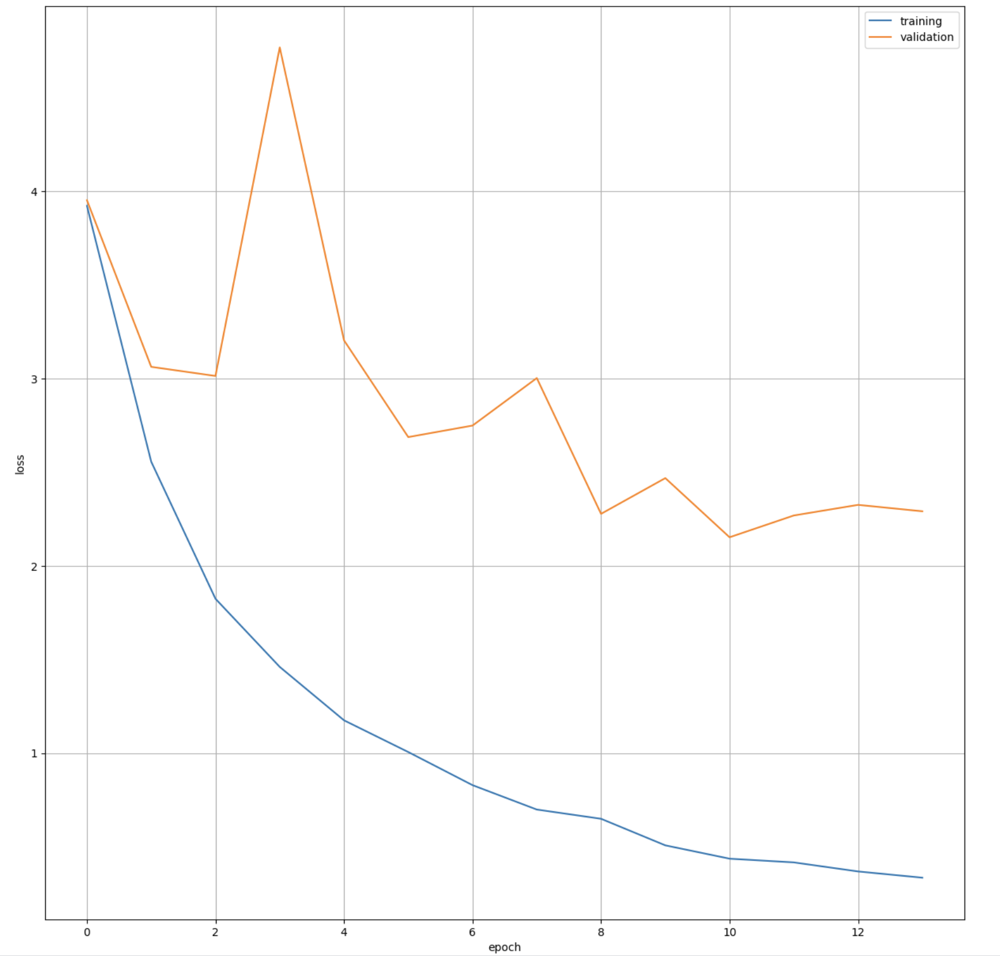
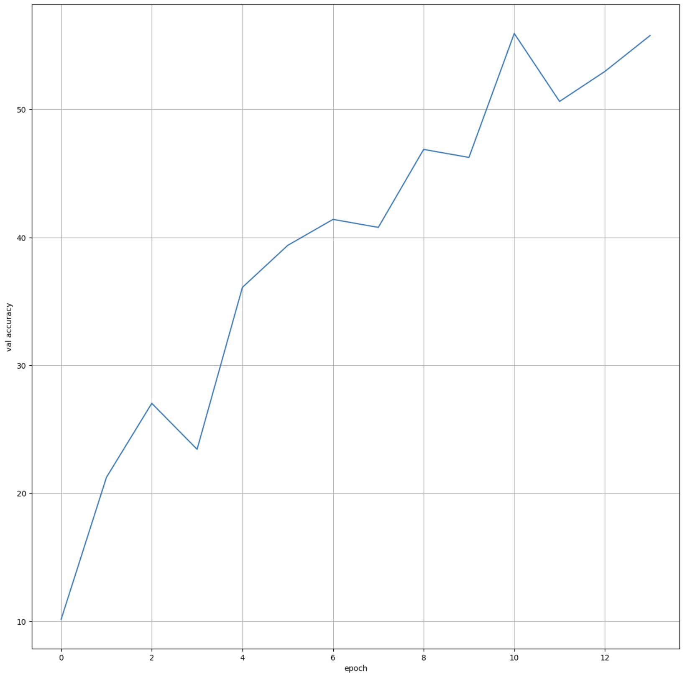
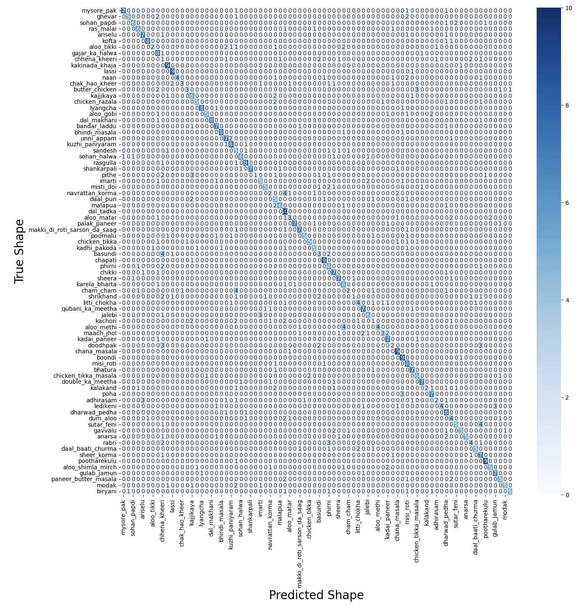

# Классификация типов почвы с помощью сверточной нейронной сети

## 1. Теоретическая база

Сверточные нейронные сети (CNN) - это класс глубоких нейронных сетей, наиболее успешно применяемых для анализа визуальных образов. Они разработаны для имитации организации_visual cortex_ животных. Основные компоненты CNN включают сверточные слои, слои объединения (пулинга) и полносвязные слои.

Сверточные слои применяют набор фильтров (ядер) к входному изображению для извлечения признаков. Каждый фильтр обнаруживает определенные признаки, такие как края, углы или текстуры. Слои объединения уменьшают пространственные размеры представления, что снижает количество параметров и вычислительную сложность. Наиболее распространенные типы объединения - максимальное и среднее.

Для задачи классификации изображений CNN обучается преобразовывать входные изображения в набор признаков, которые затем используются для предсказания класса изображения. Функция потерь, такая как кросс-энтропия, измеряет разницу между предсказанными и истинными метками классов. Оптимизатор, такой как AdamW, обновляет веса сети для минимизации функции потерь.

## 2. Описание разработанной системы

### Алгоритмы и принципы работы

Разработанная система классификации типов почвы основана на архитектуре MobileNetV3Large. Система принимает изображения почвы на вход и выдает предсказание одного из четырех классов: аллювиальная почва, черная почва, красная почва или глина.

Алгоритм работы системы следующий:
1. Предварительная обработка изображений: изменение размера до 512x512 пикселей, преобразование в тензоры PyTorch.
2. Аугментация данных: случайные горизонтальные и вертикальные отражения для увеличения разнообразия обучающих данных.
3. Пропускание изображений через сверточную сеть MobileNetV3.
4. Получение предсказаний от полносвязного классификатора.
5. Вычисление функции потерь и обновление весов сети с помощью оптимизатора Adam.

### Описание датасета

В качестве набора данных использовался датасет Indian Food Images Dataset с Kaggle (https://www.kaggle.com/datasets/iamsouravbanerjee/indian-food-images-dataset), содержащий блюда индийской кухни (80 классов)

## 3. Результаты работы и тестирования системы

Модель была обучена на 15 эпохах с использованием оптимизатора Adam и функции потерь кросс-энтропии. Размер батча составлял 64 изображений.

В процессе обучения наблюдались следующие результаты:
- Точность на тестовой выборке достигла приблизительно 56%.
- Модель не показала явных признаков переобучения.

График потерь на обучающей и валидационной выборках показал устойчивую сходимость без значительного разрыва между кривыми, что указывает на хорошую обобщающую способность модели.

Confusion Matrix на тестовой выборке показала хорошее качество классификации для всех четырех классов, с высокой точностью предсказаний для большинства образцов.

## Loss

## Accuracy

## Confusion Matrix

## 4. Выводы по работе

В ходе выполнения лабораторной работы была успешно разработана и обучена система классификации типов почвы на основе сверточной нейронной сети MobileNetV3. Достигнутая точность классификации около 80% является удовлетворительной для данной задачи.

Использование архитектуры MobileNetV3 позволило создать относительно легковесную модель, которая может быть потенциально использована на мобильных устройствах. Аугментация данных помогла улучшить обобщающую способность модели.

Анализ результатов показал, что модель способна достаточно точно различать различные типы почвы по их визуальным признакам. Матрица confusion продемонстрировала равномерное распределение ошибок между классами без явного провала в распознавании какого-либо конкретного типа.

В дальнейшем возможно улучшение результатов за счет:
- Использования предобученных весов для MobileNetV3
- Подбора гиперпараметров обучения
- Применения более сложных методов аугментации данных
- Использования ансамблей моделей

## 5. Использованные источники

1. Howard, A. G., Zhu, M., Chen, B., Kalenichenko, D., Wang, W., Weyand, T., ... & Adam, H. (2017). Mobilenets: Efficient convolutional neural networks for mobile vision applications. arXiv preprint arXiv:1704.04861.
2. Sandler, M., Howard, A., Zhu, M., Zhmoginov, A., & Chen, L. C. (2018). Mobilenetv2: Inverted residuals and linear bottlenecks. In Proceedings of the IEEE conference on computer vision and pattern recognition (pp. 4510-4520).
3. Howard, A., Sandler, M., Chu, G., Chen, L. C., Chen, B., Tan, M., ... & Adam, H. (2019). Searching for mobilenetv3. In Proceedings of the IEEE/CVF International Conference on Computer Vision (pp. 1314-1324).
4. Dataset: Soil Image Dataset. https://www.kaggle.com/datasets/jayaprakashpondy/soil-image-dataset
